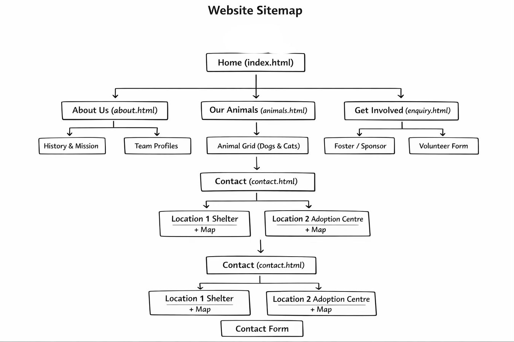

# Project Title
Paws and Claws Animal Rescue

## Student Information
**St10479129  
**Student Name:** Thokozani Mtshweni

## Project Overview

· Name: Paws & Claws Animal Rescue
· Brief History:
  Founded in 2018 by a group of veterinary nurses and animal lovers in Johannesburg, Paws & Claws began as a foster-based rescue operating from home garages. Over eight years, the organisation has grown to include a small shelter facility, a network of 50+ foster homes, and has successfully rehomed over 1,200 dogs and cats. The rescue focuses on abandoned, abused, and medically needy animals.
· Mission Statement:
  To rescue, rehabilitate, and rehome abandoned and abused animals while promoting responsible pet ownership through community education.
· Vision Statement:
  A community where every pet has a loving home, and no animal is left behind.
· Target Audience:
  Potential adopters (families, singles, seniors), foster volunteers, donors, local businesses for sponsorship, and veterinary partners.

## Website Goals and Objectives

 Website Goals and Objectives

· Goal 1: Increase pet adoptions by 30% within six months by showcasing adoptable animals online.
· Goal 2: Recruit 20 new foster volunteers per quarter through an online enquiry form.
· Goal 3: Generate monthly donations and sponsorship for medical care.

Key Performance Indicators (KPIs):

· Number of adoption enquiry form submissions.
· Volunteer/sponsor form completion rate.
· Page views on “Adopt” and “Foster” sections.
· Average time spent on animal profile pages

## Timeline and Milestones

Milestone Week Deliverable
Proposal approval Week 1 Signed proposal from lecturer
HTML structure Week 2 All 5 HTML files with basic content
CSS styling Week 3 Fully styled, responsive layout
JavaScript & forms Week 4 Form validation, mobile menu, interactive elements
Testing & final submission Week 5 Cross-browser testing, README.md, zip file

## Sitemap

  

## References

9. References

· Paws & Claws Animal Rescue. (2026). Internal rescue data and animal profiles. (Fictional organisation – original content created for this project.)
· Google Maps Embed API. (2025). Embed a map. Retrieved from https://developers.google.com/maps/documentation/embed
· Unsplash. (2026). Free animal photography. Retrieved from https://unsplash.com
· W3Schools. (2025). HTML & CSS form styling guide. Retrieved from https://www.w3schools.com